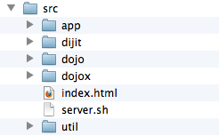

# 4.4创建Build
原文地址：https://dojotoolkit.org/documentation/tutorials/1.10/build/index.html

----------

Dojo的build系统提供了build Dojo和其它的JavaScript资源以及CSS文件的方法，从而让你的应用在生产环境下更加高效的使用它们。

##"Building" Dojo 还是 JavaScript？
如果你用过其它编程语言，你可能纳闷为什么我们要讨论"Building" Dojo 还是 JavaScript，因为build通常意味将代码编译成机器字节码。但是当我们讨论生成Dojo时，通常是关于简化、优化、串联和废代码删除这些概念。
当你从服务器端将代码发送给客户端解析时，比如JavaScript、HTML和CSS，它们将占用带宽和时间。你有多少要发送，就对应在用户知觉的延迟上加上多少对服务器的请求。不管你的代码执行的有多快，在它抵达客户端之前你都无法开始执行。
Dojo Builder是一个用来将代码尽可能最有效地配送到客户端，它包含处理自定义代码、模块和CSS的能力。如果做的好，你可以为应用创建一个易于管理和维护的build系统。

##基础
Dojo的build系统是综合和可高度定制化的。它还可以进行扩展，不过本教程不会涉及。另外，虽然在Dojo1.7引入的新bulid系统大体是向后兼容的，但它完全进行了重写，多数情况下你最好重新看待你的build，尤其是把应用转向AMD的情况。
在开始之前，你需要先理解教程中用到的几个核心概念。

### Modules and Packages
希望你在尝试本教程之前已经能理解模块。如果没有请先复习 [Defining Modules](https://dojotoolkit.org/documentation/tutorials/1.10/modules/) 教程，它们是Dojo 1.10的基础。这些模块组织成包从而构成模块的逻辑分组。在Dojo1.10中，每个包应该有一个描述包的`package.json`。许多包也包含一个`package.js`文件来提供Dojo特定的build信息。

### Dojo 配置
 Dojo内部有许多可以在应用中利用的配置选项。这些配置信息不仅对于你应用的正确运行很重要，在build应用时也可能需要提供这些配置信息作为build过程的一部分。如果你不熟悉如何配置Dojo，你需要复习[Configuring Dojo with dojoConfig](https://dojotoolkit.org/documentation/tutorials/1.10/dojo_config/) 教程。

### Layers
layer本质上是一个单独JavaScript文件，它一般会包含几个模块，有时还有其它资源。一个layer通常build的主要输出，创建这个文件然后成为你应用的可分配之处。一个layer可以是一个引导layer，它包含Dojo的引导代码可以让Dojo加载其它模块。你需要什么layer以及它们的内容都由你的应用和设计来决定。不一定有一个“正确”的方式。

### build配置文件
build配置文件是一个给builder提供代码处理相关信息的很小的JavaScript文件。在旧的build系统中，你可能只有一个配置文件，它包含了所有你需要的东西，放在`util/buildscripts/profiles`目录。Dojo1.7以后，它变得高度分散，每个包都有它自己的build配置文件，然后你还有一个主build配置文件，它指导package和layer的builder，也提供用来优化代码的配置选项。

### 压缩
这个概念是关于在不改变代码功能的前提下获取和压缩JavaScript代码。从效率的角度看它很强大并且一些开发者喜欢它让代码变的模糊，但是它让调试变得困难。这将是你不愿对“build”过的代码做开发的原因之一。Dojo Builder利用两个工具集进行压缩。第一个是ShrinkSafe，只有它能够用在1.7之前、1.7及之后的builder里。builder还可以利用Google的 [Closure Compiler](https://developers.google.com/closure/compiler/)。

### 废代码路径的移除
Google Closure Compiler的优点在于它能检测到不可访问的代码，并在文件的压缩版里将它移除。几年前，我们启动了一个名叫Dojo Linker的项目来解决相似的问题，但一直没有时间完成它，所以很高兴有一个替代方案。Dojo Builder设计的时候考虑到了这个特性。在build时可以设置几个“旋钮”来让builder输出代码的路径上“硬编码”，随后在优化时，Closure Compiler检测到某些代码一直访问不到，就会在压缩文件里将它们移除。

### Build Controls, Transforms and Resolvers
这些是build系统里的基础build模块。通常你不需要用到它们，不过如果你对高级build感兴趣，可以通过修改它们来做一些有趣的事。build control是build“指令”的设置，它读取配置文件并确定使用哪种 transform 和 resolver。transform 如字面意思一样，用于对某些事物进行转换，resolver是用来在build 时对AMD插件模块进行解析。例如，当你在用`dojo/text`了加载一个widget模板时，build时插件解析会读取这个文本并将它内联到压缩文件里。

##你需要的
使用Dojo build系统，你必须有一个[full Dojo SDK](https://dojotoolkit.org/download/#sdk)副本。Dojo的“标准发行版”已经用build系统build过了。build工具本身依赖于Java（可选，Node.js用在更快的build），所以确认下你已经安装了它。

##布置你的应用
这是最大的挑战之一，尤其是当你已经超越了非常基础的应用。我们已经注意到许多从Dojo1.6和更早版本迁移过来的人，他们设计了我们预期之外非常奇怪的应用结构。这就是说许多人在将他们的build迁移到Dojo 1.7及之后版本时遇到了挑战。所以在你的应用偏离之前，你需要考虑如何布置它们。
形式上需要一个`src`目录，所有你的包都要放在这个根目录下。通常你需要像这样：

Dojo的主体包（`dojo`、`dijit`和`dojox`）和其它包并列，包括你的自定义包，在加上Dojo实用工具（`util`）。

如果你不想从头开始， [Dojo Boilerplate](https://github.com/csnover/dojo-boilerplate)包含了你起步所需的一切，不仅有基本应用程序的布局，而且已经为build进行了配置。

##包
为了用build系统来创建一个build，你的主应用包目录里必须包含两个文件。第一个是 [CommonJS Packages/1.0](http://wiki.commonjs.org/wiki/Packages/1.0)  包描述，它通常命名为`package.json`，放在包根目录下。第二个文件是一个build配置文件，它包含了如何用build工具处理包目录的相关信息。这个文件的命名有两个主要约定。在Dojo Toolkit里它叫做`<package name>.profile.js`，放在包的根目录下。另一个约定是将配置文件命名为`package.js`放在包的根目录下。你会在 [Dojo Foundation Packages](http://packages.dojofoundation.org/)看到这种约定。

通常，你会只有一个包来内含你全部的应用，但是如果你已经把你的代码分解到多个包里（例如，在不同的包里使用shared/common模块），你需要对每个包都创建这些文件。


##包描述 
包描述文件(package.json)提供当前包的信息，例如包的名字、它依赖包的信息、许可的链接和bug追踪信息等。鉴于Dojo build系统的目的，真正重要的是一个特殊键`dojoBuild`，尽管它通常只提供一个名称、版本和描述。`dojoBuild`键用来指向包的build配置文件。给出一个名为`app`的包作为例子，一个基础`package.json`像下面这样：
```
{
    "name": "app",
    "description": "My Application.",
    "version": "1.0",
    "keywords": ["JavaScript", "Dojo", "Toolkit", "DojoX"],
    "maintainers": [{
        "name": "Kitson Kelly"
    }],
    "contributors": [{
        "name": "Kitson Kelly"
    },{
        "name": "Colin Snover"
    }],
    "licenses": [{
        "type": "AFLv2.1",
        "url": "http://bugs.dojotoolkit.org/browser/dojox/trunk/LICENSE#L43"
    },{
        "type": "BSD",
        "url": "http://bugs.dojotoolkit.org/browser/dojox/trunk/LICENSE#L13"
    }],
    "bugs": "https://github.com/example/issues",
    "repositories": [{
        "type": "git",
        "url": "http://github.com/example.git",
        "path": "packages/app"
    }],
    "dependencies": {
        "dojo": "~1.10.4",
        "dijit": "~1.10.4",
        "dojox": "~1.10.4"
    },
    "main": "src",
    "homepage": "http://example.com/",
    "dojoBuild": "app.profile.js"
}
```
 [CommonJS Packages/1.0](http://wiki.commonjs.org/wiki/Packages/1.0)规范为包描述提供了可选项的一个全部列表。如果你计划只在内部使用你的代码，你可以将它退到最小配置，不过你至少要包含`dojoBuild`来让builder能找到你的build配置文件。

##包build配置文件

